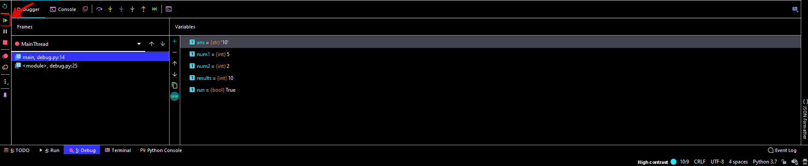

### DEBUGGING In Pycharm ###

- Breakpoint: breaks the code at the placed point as shown below. We dont
stop running but rather just take a break at this point. You can add multiple
breakpoints. 

- When we break we two windows, one that shows our frames (scopes) in the left pane and one that 
shows the variables within that scope on the right. this allows you to see what the value
of all the variables assigned to this point without having to print each variable. 

- if we want to check an expression with the current variables we can click the + button
and create and expression. There is also a little '-' button you can click to delete expressions:

- in this case, we check to see if the str(ans) was equal to the results and we get false

- To continue running, you can click the resume button as shown below:

- Note you will have to go back into the console window if there are
any inputs waiting for you to continue. 

- These are some other features that we can use to move through the
debugging process; you might have to play around with these to get 
the results you are looking for: 

    - **Step over**: Skip over the next line of code
    
    - **Step into**: run line by line in your code without adding breakpoint; note this will
    step into other modules, methods, things that my not be part of your code
    
    - **Step into my code**: run line by line in your code. Note it might be useful to have two 
    breakpoints with the code in question between them. 
    
    - **Step out**:
   
    - **Run to cursor**:

- From left to right: step over, step into, step into my code, 
force step into, step out, run to cursor

- Here we can use the evaluate expression button to create any expression with any variables we have access to 
at our breakpoint: 

- Different scopes are presented in the left window, for example, at this point
we have a scope for the function gen_random, main, and the module itself (__name__ == '__main__'). 
Each contain their respective variables found in their local scopes.
